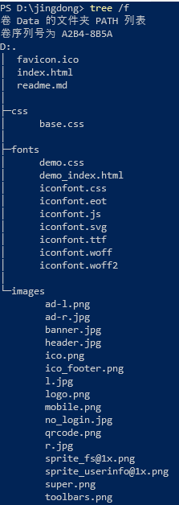

# 京东网站模仿

* 本项目是模仿jd网站，思路是先写好html+css，力求做到完全一致。
* github地址：https://github.com/namexiaolu/JDlianxi.git
* coding地址：https://git.coding.net/lhomg/jingdonglianxi.git
* 在线查看 https://namexiaolu.github.io/JDlianxi/
* 或者 http://lhomg.coding.me/jingdonglianxi/

### 设计框架

先总体规划好要用几个文件，目录怎么排。以下是我的目录 ↓



favicon.ico是网站的小图标，css中存放css，目前只写了base.css,包括每个页面相同的部分（头、脚）。之后会加上每个页面固定的css。fonts为iconfont存放的位置，用的阿里的图标。images存放网站用到的图片。

## 首页上边的广告条

大盒子中有小盒子，小盒子中存放广告图，在css中全局定义一个版心，我用的.w{}定义的，里边写宽，和居中(magng 0 auto),右上角的小叉号用的阿里的iconfont，定位定到那里。并加上class，以备之后js用。

## 导航栏

## 购物车
右上角的小红色圆圈，用定位。

## 导航栏信息（navitems)
用三个ul分成三份，每个ul的margin-left 30；

- 文字垂直居中

  height 40
  line-height 40

- 字体加粗

  font-weight:700; 字体加粗的意思。

- 复制文字小技巧
    复制三个 然后 按住alt 选三个位置，粘贴，那么这三个复制的文字就会依次粘贴到这三个位置，很棒。

- 量字体高度的方法，可以先量明显一侧的高度，然后把这一侧的高度复制到另一侧，再量整个的高度，在css中直接写height和line-height就行了。

### 文字间的小分割线的设计
设置宽高、外边框。

## 底部footer
h560
分为三栏
    * 通栏+版心
        h100;
        底部搞一个线
        * 版心
            * 版心
版心里边w225
h42


### 精灵图的用法
 * 先写上bg url no-repeat
 * 然后设置好宽高
 * bg-position: x轴 y轴;

### 交集选择器
    ```html
    <div class = "aaa">
        11111
        <div class = "aaa">
            22222
            </div>
    </div>
    ```
    ```css
    div.aaa{
        color:red;
    }
    ```
* 注意交际选择器和正常的不一样。例如：div.aaa指的是111和222这两部分，而div .aaa指的是2222这部分。
## footer-help

用dl>dt>dd

* 中间出了小插曲，不小心写*{margin和padding 0}的时候 把颜色也加上了，导致footer-help的颜色跟背景色不一样。


## footer-copyright 
文字排版简直麻烦的要命，

精灵图也要每次都量距离，想知道为啥不用iconfont解决图标问题，非要用精灵图，神奇。

# main部分开始
思路：
* 一个通栏大盒子，包含中间主要内容和两边的像翅膀一样的广告条。

* 大翅膀广告是一个大a 宽度是通栏。

* 中间主要内容要压在 广告的上边。
    * 用定位来做，“子绝父相”， 让a浮在中间内容上。
        * 定位的话会把让内容转化为行内块元素，根据内容显示，因为此处我们用的是背景图，所以必须给盒子加上宽高才能显示出来，h480，w100%；
        * 此时，中间内容被a挡住，点不到，我们只需给中间内容这个盒子加一个定位relative再加一个z-index:1.(只有定位盒子有z-index)
    
    ### 中间内容开始
    
    

* 此时，广告的内个大盒子会不是居中对齐，需要加上 top center

  ```   background: url(../images/bg.png) no-repeat top center; ```
  
  例子
  https://www.runoob.com/try/try.php?filename=trycss_background
### clo1

观察，发现整个一个条就是一个li

* 当你的大盒子有高，写paddingtop要减大盒子的高

#### 上

轮播，左右各一个上一页下一页。

几个点，标志着到第几张图了。
### clo3-server
必须要让四个盒子在一行显示，每个盒子47px，（47*4=192）但是外边的大盒子有190px，必定会掉下来，此时用到儿子比父亲高的特性，给ul一个宽，然后给clo3-server一个overflow-hidden.就可以4个一排，把多余的那一个边框切开了。

### css3盒模型

css2是外加模式

css3 是内减模式 盒子不会被撑开。

### 过渡

transition （4个属性、给谁，何时开始，进行多长时间）

### 变形（transform）

移动 translate 

缩放 scale

旋转

- 常用

  transform: translate(-50%,-50%);走自己的一半。

- 注意

  transform：translate；
  transform：scale；
  这样写会层叠，要连写才能两个效果都出来。（顺序有关系，先写哪个先执行哪个）

  
### 动画（animation）

  先声明后调用。

声明：@keyframes

```
@keyframes move {
	from {
	left:0:
	bgc:green;
	}
	to {
	left:100;
	bgc:blue;
	}
}
```


调用：animation：动画名称 花费时间 运动曲线 何时开始 播放次数 是否反方向

- 播放次数默认是1 无限是infinite
- 是否反方向：normal alternate（轮流反向播放）

例子：


  